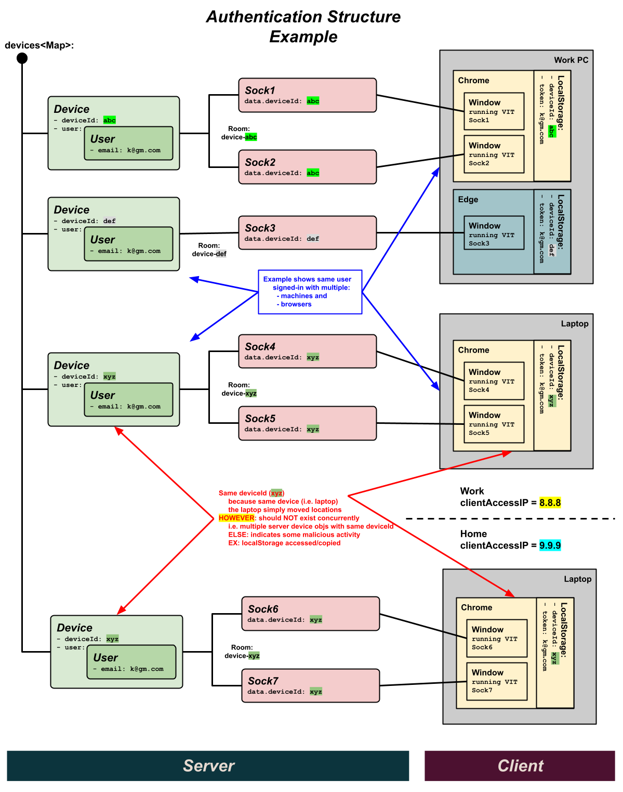

# Auth

**AI:** ?? DO NOT publish anything here that would give too much
insight to a hacker.

This section describes the internals of **visualize-it**'s
authentication and authorization.

You are not required to sign-in to **visualize-it**.  You can build
**visualize-it** packages and run systems from file-based resources.

For "system participation" _(running a system)_ however, you must at
minimum (when not signed-in) supply a "Guest Name" (that identifies
you to other participants).

To get the full benefit of **visualize-it**, you must establish a free
account.  This allows you to perform more advanced features, like
publishing and promoting packages that you build in the cloud.

## Authentication & Authorization

[Authentication vs Authorization - What's the Difference?](https://www.freecodecamp.org/news/whats-the-difference-between-authentication-and-authorisation/)

- **Authentication** confirms that users are who they say they are.
- **Authorization** gives those users permission to access a resource (i.e. enablement).


## Authentication Process

Sign-In Authentication is is accomplished exclusively through a valid
email.  No password is required.  The email account must be verified
by supplying a short-lived verification code sent to the email account.
This confirms the user is the owner of the email.

Once a verified account is established, an encrypted token is retained
on the device (in browser localStorage), that allows the user
to auto-authenticate on subsequent sessions.

This account email verification process can potentially be required
multiple times.  This is due to the fact that (for security reasons)
the authentication process is tied to both:

- the device (ex: different browsers such as chrome/edge/safari/etc)
- and the client network (ex: different locations and wifi access points)

This provides a relatively secure environment, which maximizes
ease-of-use for the end user.

## Authentication Implementation

The following diagram illustrates the major authentication structures
that are maintained by our server:


1. Our client app maintains a "virtual" deviceId that correlates to a
   "virtual" device.  This is a randomly generated ID that is retained
   on the device (in browser localStorage).  As a result,
   the deviceId has the same scope of localStorage (i.e. shared within
   a browser instance accessing the same web site).

1. Our server associates any session of the same device to a single
   user.  It pro-actively synchronizes any authentication changes
   (such as sign-in/sign-out) to **ALL** sessions of that device.

   In other words, if a user opens visualize-it on multiple browser
   windows, they will all sync to the same user, with the same
   credentials.

   This is maintained through the following association:

    - **Device obj**: A virtual device defined as any browser instance
      (e.g. chrome/edge/safari/etc) running the same
      visualize-it site (ex: in multiple windows).

      The device **contains** a User obj, so all sessions
      from the same device will have the same enablement.

      In reality, the Device obj is a very thin layer over the User
      obj _(so as to not polute device keys into the User obj)_.

    - **User obj**: Represents the user with both profile and
      enablement information.

      The User obj is maintained on both the client and server, and
      has a consistent API.

      The client rendition is a singleton _(because it services the
      entire module scope)_, and is a reactive svelte store _(so
      changes are immediately reflected throughout the code base)_.

      From a server perspective, many User objects are maintained
      _(because the server manages multiple clients)_.  User objects
      are "contained in" and "accessed through" the Device obj.

      - **Please NOTE** that it is possible for multiple devices to
        contain copies of the same logical user.

        This will occur when a user concurrently accesses visualize-it
        from :
        1. different computers
        2. different browser instances (e.g. chrome/edge/safari/etc)
        3. different locations

        **This is OK!**

        Keep in mind that, when this happens, there is **NO**
        synchronization between these devices _(as there is between
        active browser windows of the same device)_.

    - **Socket obj**: A single WebSocket is maintained for every
      visualize-it app instance.  **visualize-it** needs this
      real-time communication to run it's systems.

      As a result, each socket is logically associated to a browser
      window (running **visualize-it**).

      **SideBar**: The **visualize-it**'s architecture takes advantage
      of this, and uses this socket for **all** it's client/server
      communication (i.e. API's).

      As a result, visualize-it authentication is closely tied to the
      socket.  In other words, authentication occurs at socket
      creation time.  This means that all messages from a given socket
      have the authority of it's associated user/device.

      Keep in mind that the user content associated in a socket can
      change over time.  The user may start out as an authenticated
      user (John Doe), but if they sign-out, the user object morphs
      into a "guest" user.

      - Using the real-time socket protocol, these User changes are
        dynamically reflected on all clients (browser windows) of a
        given device.

    - The server maintains bi-directional relationship between
      Device(User)/Socket(window)

      ```
      Device (user) --1:M--< Socket (browser windows) with back-ref socket.data.deviceIdFull
      ```

      This relationship is maintained through two aspects:
      * each socket contains a `deviceIdFull` that references the device/user
        ```
        socket.data.deviceIdFull
        ```
      * the device maintains a collection of sockets using a socket.io room
        ```
        ROOM NAME: device-{deviceIdFull}
        ```
        - this has the advantage of dynamically auto syncing (by
          socket.io) when sockets are disconnected.
        - in addition, the room can be used to broadcast messages for things
          like user state changes to all windows of a device.
      
1. To supplement security considerations and account theft,
   **visualize-it**'s auto-authentication process supplements deviceId
   with a verification of the client's IP address.

   This is where deviceIdFull comes into play:
   `deviceIdFull = deviceId + clientAccessIP`

   The authentication process retains all the clientIP addresses that
   a user authenticates on.  Only those IP addresses are allowed for
   auto-authentication (i.e. auto sign-in at app startup).

   This means that when a user accesses the app from a different
   location (a different WiFi router / IP address), they will
   initially have to re-authenticate (for that location).

   - A relative stable access of clientIP can be found in the http
     header that created the socket connection (see clientIP below).

   - As it turns out,this is more of a clientAccessIP address
     * multiple client devices will have the same clientIP when they
       are on a common router

   - A proxy may even make it more broader scoped (not certain)
     * having even MORE people with the same clientIP (behind the proxy)

   - As a result, the clientAccessIP is managed as follows:
     * we still use the virtual deviceId
     * we retain all authenticated clientAccessIP addresses in our
       user DB
     * authentication will retain any new clientAccessIP in it's user
       DB
     * auto-authentication requires a match of one of the user's
       clientAccessIPs


## Example

The following diagram shows an Authentication Structure rendering in a
live example.  It is limited to a single user (k@gm.com).  It
highlights the various scenarios that can occur with the user running
visualize-it on multiple machines, in multiple browsers, and in
different locations.




## Malicious Identity Detection

Overall, the risk from Malicious Identity theft is thought to be
minimal, as it would require physical access to your computer's
localStorage.  This assumes of course that all
[XSS](https://en.wikipedia.org/wiki/Cross-site_scripting) doors have
been shut.  Even should these resources be nefariously accessed, there
are safegaurds in place that minimize it's usefulness.

1. ??$$ From the diagram above, you can see that it is possible for the
   same deviceId to alternate clientAccessIP addresses.  A simple example
   of this is when laptop moves locations, resulting in different network
   access points.
   
   That being said, this should NEVER exist concurrently.  In other
   words we should never see multiple active device objects with the
   same deviceId.  This indicates some malicious activity _(or
   inappropriate sharing of acount information)_.  For example, the
   localStorage of one user's machine has been accessed and copied to
   another machine.
   
   The system will actively check for this scenerio, and mark it in
   such a way that requires the user to re-authenticate.
   
   - ??$$ I think this IS the PANIC button AUTOMATED
   - ??$$ HOW
   - ??$$ WHERE (WHAT CODE)
     * I think it is in preAuthenticate()
       JUST before it starts to create a new Device
       >>> actually it could be in the createDevice() which is only invoked in preAuthenticate()
           ... just before it catalogs the device
               ALSO enhance createDevice() to setup association to socket <<< may be tricky for existing devices ... possibly look it up and use existing
           ... the check could do a search and insure offending devices do NOT exist
               AND do the initiative
               ALSO returns null (when issue was found)
               INVOKER would need to interpret undefined

   - The varient of this scenerio is when the malicious activity
     occurs at seperate times from when the real user is active.

     BAD: Currently, this cannot be detected.  ??$$ can we address this
     

2. ??$$ A variant of the above malicious activity can manifest itself
   if this occurs within the same network (i.e. the same
   clientAccessIP address).

   This manifests itself with the socket connections of the malicious
   user being grouped in to the same Device object instance as the
   real user.

   This can manifest itself in two ways:

   - Concurrently: When both the real user and the malitious user is
     active at the same time.

     * ??$$ Assuming that the IDE is being used in this scenerio
       (where presumably the most damage can occur - IS THIS TRUE),
       the system will issue warnings to all parties that the IDE
       should NOT be concurrently active in multiple sessions (because
       no synchronization occurs).  This is an indicator to the real
       user that they should activate the PANIC button (??$$ detail
       what this does).

     * ??$$ There is a minor indication that this has occured - if one
       user signs-out, all users of the device will be signed-out.

       While this is certainly a crucial indicator to the real user,
       it is doubtful that the malicious user would initiate a
       sign-out.

       ?? NOT TRUE IF WE IMPLEMENT BETTER SIGN-OUT: Even when the real user signs-out, it doesn't do all much to
       the malicious user.  They are merely signed-out - but their
       localStorage credentials are NOT updated.  Currently
       localStorage is only updated on the client socket that
       initiated the sign-out request (not the malicious user).  EVEN
       if this were addressed, the malicious user could simply
       manually re-instate the localStorage.

   - Independently: When the malicious user is active at seperate
     times of the real user.

     BAD: Currently, this is NOT detectable. ??$$ can we fix this?

   Overall, this is thought to be minimal risk, as the attacker
   represents an "inside" job ... thoughts?

?? Overall, a prevention technique to minimize malicious activity (if
that is a problem for a user) is to sign-out frequently.  This process
employs safegaurds that internally reset any saved credentials, making
them invalid. ?? WHEN sign-out does the proper things (sign-out ALL
users of this account, spanning multiple devices, and clear accepted
validations from DB, and reset deviceId)


??$$ Even if/when all these vulnaribilities are plugged, what prevents
the malitious user from simply going back to the well and re-stealing
the current active localStorage items.  It kinda depends on if this theft
was done remotely (via XSS) or if it was from access to the physical machine?

### Proactive Prevention of Malicious Activity

??$$ CUR POINT

??$$ rather than a Panic Button (Force Re-Authentication)
     I think I can just do necessary things in an explicit sign-out process
     1. force ALL active users of that email to sign-out
        ... done via active socket connections
     2. for the initiatator, reset the deviceID
        ... this will thwart any thief, as their copied deviceId is no longer valid
     3. clear the acceptable DB entries for that email
        ... this will thwart any thief, as their copied deviceId is no longer valid
     >> this way, if we need to communicate a potential issue (to the user), we can tell them to simply sign-out and back in again
        ... WORDING: by signing-out you reset some internals that will help to keep your account secure
     >> ALSO, may want to FORCE logout on some timeout of token

- Maintain a persistent DB to:
  * ?? retain acceptable (i.e. authenticated) email/deviceId+clientAccessIP pairs
  * ?? mark tainted deviceIds <<< PROB NOT NEEDED ... if we simply CLEAR table above


- NOTES:
  * CURRENTLY deviceId is only retrieved in preAuthenticate() for the sole purpose of cataloging the Device object
    WE ALWAYS catalog the Device object in-memory ... at minimum with a Guest user
  * ALSO we only can get to the sign-in screen FOR guests
  * THIS IS OK

- PreAuthenticate:
  * get accetable deviceId that is NOT on the tainted list                         <<< a MOD to our current process
    ... will itterativally ask for deviceId to be re-set (on the client)
  * get token (email) ... as normal
  * if email/deviceId+clientAccessIP IS NOT in acceptable DB: NO PRE-AUTHENTICATE  <<< a MOD to our current process
    ... this WAS: isEmailAuthenticatedOnIP(emailFromToken, clientAccessIP)
    ... NOW is:   isEmailPreAuthenticatedOnDB(email, deviceIdFull);
  * otherwise: WE ARE IN

- SignIn:
  * this process is unchanged (I THINK)
    ... it continues to authenticate a new user email (as always)
    ... the Device/User pre-exsits: we will morph it into a signed-in user

> CALL IT: Force Re-Authentication (NOT Panic)
- ?? Panic Button Process: <<< FORCE re-authentication for this email account (on any location and forced new deviceId)
  * PARAMS: 
    - logically a socket, which in turn identifies
      * email of user  <<< KEY
      * deviceId       <<< KEY
      * clientAccessIP ... UNUSED (I think)
  * PROCESS:
    - mark deviceId as tainted
      * which causes it to be regenerated automatically
      * and invalidates any stored token (because will NOT match DB authenticated pairs)
        ... causing them to have to re-authenticate (i.e. re-validate their email)
    - optionally clear the PreAuthenticatedOnDB entries for this user (email)
      ... could leave them but they are auto tainted
    - auto sign-out ANY user on ANY device with this email account
      >>> OR is it with this deviceId (I think this is appropriate)
          - UNSURE: if so, we may want to insure the deviceId is NOT tainted in the sign-in process
                    ... so as to do what?
      ... this merely changes all in-memory user stores for this email (both client/server)
      ... EVEN SO, they MUST sign-in (and email verify) to get it back
      ... IF they simply REFRESH browser (going through preAuthenticate), their deviceId has been tainted, so it will be re-set -and- they start out as Guest
          ?? I-THINK-THIS-IS-SOLVED: somehow must force MORE than just a sign-in BECAUSE we currently don't do anything with deviceId/clientAccessIP in sign-in process


## Work In Progress

1. **CONSIDER** - If a malicious user get's access to your localStorage
   and copies 2 items (deviceId/token) they can steal your identity.

   **FIX** (at least a step in the right direction): supplement with
     clientIP.
   
   - Risk is minimal, unless user has access to your computer. <<< HOWEVER is there is a XSS hole I don't know about?
     * Public WiFi is not an issue.
     * Shared public computer is _(they MUST sign-off when done)_.

   - Need a more sophisticated process with private/public key or
     something else (like clientIP).

   - NO (too intrusive): A **Partial FIX** would be to require email verification on each sign-in.
     * BIG hassle to the user
     * We could do this only on first access within the device.

   - ?? YES: A **Better FIX** would be to mix-in the client IP address _(in
     addition to the deviceId)).  This would greatly minimize the
     problem _(see next point)_.

   - HMMM: Also could periodically check if same email is being used across
     devices.  This may be suspicious, and mark this email (in our DB)
     to require re-validation.  THIS NO NO GOOD ... once re-validated,
     then the hacker is IN again ... hmmm.


1. how to access clientIP

   **BOTTOM LINE**: access via:
   ```js
   // X-Forwarded-For: <client>, <proxy1>, <proxy2>
   const clientAccessIP = socket.handshake.headers['x-forwarded-for'].split(',')[0];
   ```

   ```
   ... https://stackoverflow.com/questions/6458083/get-the-clients-ip-address-in-socket-io
       - Not getting remote address while using proxy in socket.io
         ... https://stackoverflow.com/questions/11182980/not-getting-remote-address-while-using-proxy-in-socket-io
       - KJB: these posts are VERY old
              I suspect it may be problematic behind a proxy
              KEY: Need to try BOTH localhost (dev) and heroku (prod)
       - TRY: 
         >> FROM: https://stackoverflow.com/questions/11182980/not-getting-remote-address-while-using-proxy-in-socket-io
            ... SOME conn, SOME connection
         1. socket.handshake.headers['x-forwarded-for'] || socket.request.connection.remoteAddress;
         >> FROM: https://stackoverflow.com/questions/6458083/get-the-clients-ip-address-in-socket-io
         2. socket.handshake.address ... THINK returns the Server's IP, not the Client's IP
         3. socket.request.connection.remoteAddress
         4. const sHeaders = socket.handshake.headers; <<< this includes the port
            console.info('[%s:%s] CONNECT', sHeaders['x-forwarded-for'], sHeaders['x-forwarded-port']);
         5. socket.handshake.headers['x-forwarded-for'] || socket.conn.remoteAddress.split(":")[3]
         6. socket.request.connection._peername <<< NOT part of the official API
         7. socket.manager.handshaken[socket.id].address
         8. socket.conn.remoteAddress
         9. socket.handshake.headers['x-forwarded-for'].split(',')[0]
   ```

   **Here is a code snippet to test this ... shows usage in BOTH dev and prod servers**
   ```js
     // XX TEST to see if we can get the clientIP                                                              //     USAGE:     localhost/dev  heroku/prod
                                                                                                               //                =============  ===================
     const clientIP1 = socket.handshake.headers['x-forwarded-for'] || socket.request.connection.remoteAddress; // ... clientIP1: '::1',         '71.81.153.137'      <<< USE THIS
     const clientIP2 = socket.handshake.address; // THINK returns the Server's IP, not the Client's IP         // ... clientIP2: '::1',         '::ffff:10.1.46.221'
                                                                                                               //                               '::ffff:10.1.26.125' ... appears to change over time 
     const clientIP3 = socket.request.connection.remoteAddress;                                                // ... clientIP3: '::1',         '::ffff:10.1.46.221'
   
     const sHeaders = socket.handshake.headers; // this includes the port
     const clientIP4 = sHeaders['x-forwarded-for'] + ':' + sHeaders['x-forwarded-port'];                       // ... clientIP4: 'undefined:undefined'  
                                                                                                               //                               '71.81.153.137:443' ... port changes frequently (prob used to delineate multiple clients)
   
     const clientIP5 = socket.request.connection._peername; // NOT part of the official API                    // ... clientIP5: { address: '::1', family: 'IPv6', port: 61732 }
                                                                                                               //                               { address: '::ffff:10.1.46.221', family: 'IPv6', port: 23759 }
   //const clientIP6 = socket.manager.handshaken[socket.id].address;
     const clientIP7 = socket.conn.remoteAddress;                                                              // ... clientIP7: '::1'          '::ffff:10.1.46.221'
   //const clientIP8 = socket.handshake.headers['x-forwarded-for'].split(',')[0];
   
     // KJB ATTEMPT: 
     const clientIP9  = socket.handshake.headers['origin'];  // KJB: more like the server name (I THINK)       // ... clientIP9: 'http://localhost:8085'
                                                                                                               //                               undefined
     const clientIP10 = socket.handshake.headers['referer']; // KJB: more like the server name (I THINK)       // ... clientIP10: 'http://localhost:8085/'
                                                                                                               //                               'https://dmrst.herokuapp.com/ide/'
     log(`XX clientIP attempts: `, {clientIP1, clientIP2, clientIP3, clientIP4, clientIP5, clientIP7});
   //log(`XX clientIP headers:  `, socket.handshake.headers);
     log(`XX clientIP KJB attempts: `, {clientIP9, clientIP10});
   ```

   **NOTE**: '::1' is the loopback address in ipv6, equivalent to
   127.0.0.1 in ipv4 _(see: [localhost](https://en.wikipedia.org/wiki/Localhost))_.


