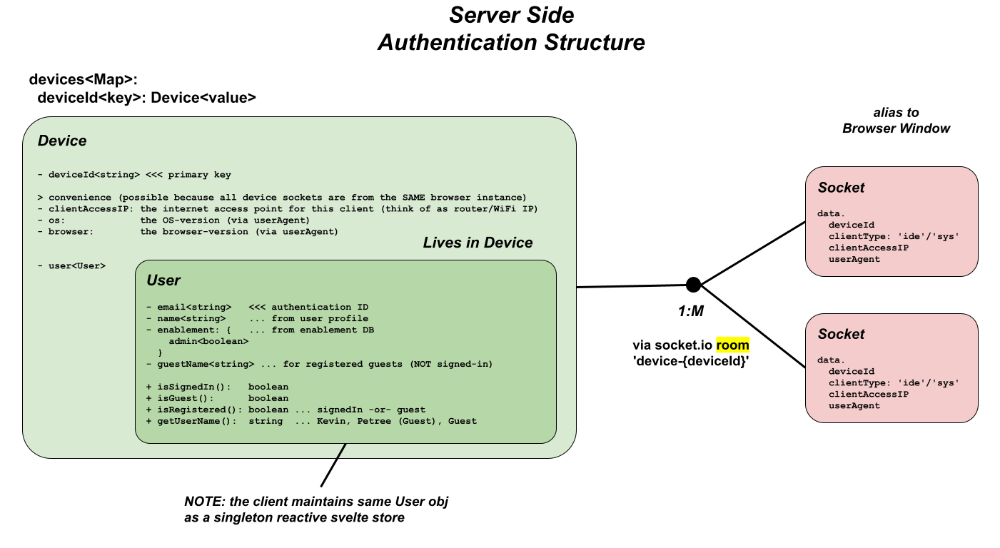

# Auth

This section describes the internals of **visualize-it**'s
authentication and authorization.

You are not required to sign-in to **visualize-it**.  You can build
**visualize-it** packages and run systems from file-based resources.

For "system participation" _(running a system)_ however, you must at
minimum (when not signed-in) supply a "Guest Name" (that identifies
you to other participants).

To get the full benefit of **visualize-it**, you must establish a free
account.  This allows you to perform more advanced features, like
publishing and promoting packages that you build in the cloud.

## Authentication & Authorization

[Authentication and Authorization](https://medium.com/geekculture/authentication-and-authorization-a5a2eafdde16)

[Authentication vs Authorization - What's the Difference?](https://www.freecodecamp.org/news/whats-the-difference-between-authentication-and-authorisation/)

- **Authentication** confirms that users are who they say they are.
- **Authorization** gives those users permission to access a resource (i.e. enablement).


## Authentication Process

Sign-In Authentication is is accomplished exclusively through a valid
email.  No password is required.  The email account must be verified
by supplying a short-lived verification code sent to the email
account.  This confirms the user is the owner of the email. This
process is sometimes refereed to as "Dynamic Password" or OTP (One
Time PIN).

**AI:** ?? The remainder of this document provides too much insight to a hacker (remove it from public consumption)

Once a verified account is established, an encrypted token is retained
on the device (in browser localStorage), that allows the user
to auto-authenticate on subsequent sessions.

This account email verification process can potentially be required
multiple times.  This is due to the fact that (for security reasons)
the authentication process is tied to both:

- the device (ex: different browsers such as chrome/edge/safari/etc)
- and the client network (ex: different locations and wifi access points)

This provides a relatively secure environment, which maximizes
ease-of-use for the end user.

## Authentication Implementation

The following diagram illustrates the major authentication structures
that are maintained by our server:



1. Our client app maintains a "virtual" deviceId that correlates to a
   "virtual" device.  This is a randomly generated ID that is retained
   on the device (in browser localStorage).  As a result,
   the deviceId has the same scope of localStorage (i.e. shared within
   a browser instance accessing the same web site).

1. Our server associates any session of the same device to a single
   user.  It pro-actively synchronizes any authentication changes
   (such as sign-in/sign-out) to **ALL** sessions of that device.

   In other words, if a user opens visualize-it on multiple browser
   windows, they will all sync to the same user, with the same
   credentials.

   This is maintained through the following association:

    - **Device obj**: A virtual device defined as any browser instance
      (e.g. chrome/edge/safari/etc) running the same
      visualize-it site (ex: in multiple windows).

      The device **contains** a User obj, so all sessions
      from the same device will have the same enablement.

      In reality, the Device obj is a very thin layer over the User
      obj _(so as to not pollute device keys into the User obj)_.

    - **User obj**: Represents the user with both profile and
      enablement information.

      The User obj is maintained on both the client and server, and
      has a consistent API.

      The client rendition is a singleton _(because it services the
      entire module scope)_, and is a reactive svelte store _(so
      changes are immediately reflected throughout the code base)_.

      From a server perspective, many User objects are maintained
      _(because the server manages multiple clients)_.  User objects
      are "contained in" and "accessed through" the Device obj.

      - **Please NOTE** that it is possible for multiple devices to
        contain copies of the same logical user.

        This will occur when a user concurrently accesses visualize-it
        from :
        1. different computers
        2. different browser instances (e.g. chrome/edge/safari/etc)
        3. different locations

        **This is OK!**

        Keep in mind that, when this happens, there is **NO**
        synchronization between these devices _(as there is between
        active browser windows of the same device)_.

    - **Socket obj**: A single WebSocket is maintained for every
      visualize-it app instance.  **visualize-it** needs this
      real-time communication to run it's systems.

      As a result, each socket is logically associated to a browser
      window (running **visualize-it**).

      **SideBar**: The **visualize-it**'s architecture takes advantage
      of this, and uses this socket for **all** it's client/server
      communication (i.e. API's).

      As a result, visualize-it authentication is closely tied to the
      socket.  In other words, authentication occurs at socket
      creation time.  This means that all messages from a given socket
      have the authority of it's associated user/device.

      Keep in mind that a socket connection out-lives a given user
      sign-in.  This socket connection is established for the duration
      of the app, and the user can change over time _(through
      sign-in/sign-out)_.  As a result, the user content associated in
      a socket can change over time.  The user may start out as an
      authenticated user (John Doe), but if they sign-out, the user
      object morphs into a "guest" user.

      > Using the real-time socket protocol, these User changes are
      > dynamically reflected on all clients (browser windows) of a
      > given device.

    - The server maintains bi-directional relationship between
      Device(User)/Socket(window)

      ```
      Device (user) --1:M--< Socket (browser windows) with back-ref socket.data.deviceId
      ```

      This relationship is maintained through two aspects:
      * each socket contains a `deviceId` that references the device/user
        ```
        socket.data.deviceId
        ```
      * the device maintains a collection of sockets using a socket.io room
        ```
        ROOM NAME: device-{deviceId}
        ```
        - this has the advantage of dynamically auto syncing (by
          socket.io) when sockets are disconnected.
        - in addition, the room can be used to broadcast messages for things
          like user state changes to all windows of a device.
      
1. To supplement security considerations and account theft,
   **visualize-it**'s auto-authentication process supplements deviceId
   with a verification of the client's IP address.

   The authentication process persistently retains all the clientIP
   addresses that a user authenticates on.  Only those IP addresses
   are allowed for auto-authentication (i.e. auto sign-in at app
   startup).

   This means that when a user accesses the app from a different
   location (a different WiFi router / IP address), they will
   initially have to re-authenticate (for that location).

   - A relative stable access of clientIP can be found in the http
     header that created the socket connection (see clientIP below).

   - As it turns out,this is more of a clientAccessIP address
     * multiple client devices will have the same clientIP when they
       are on a common router

   - A proxy may even make it more broader scoped (not certain)
     * having even MORE people with the same clientIP (behind the proxy)

   - As a result, the clientAccessIP is managed as follows:
     * we still use the virtual deviceId
     * we retain all authenticated clientAccessIP addresses in our
       user DB
     * authentication will retain any new clientAccessIP in it's user
       DB
     * auto-authentication requires a match of one of the user's
       clientAccessIPs


## Example

The following diagram shows an Authentication Structure rendering in a
live example.  It is limited to a single user (k@gm.com).  It
highlights the various scenarios that can occur with the user running
visualize-it on multiple machines, in multiple browsers, and in
different locations.


From the diagram above, you can see that it is possible for the same
deviceId to alternate clientAccessIP addresses.  A simple example of
this is when a laptop moves locations, resulting in different network
access points.

That being said, this should NEVER exist concurrently.  In other words
we should never see different browser instances with the same
deviceId.  This indicates some malicious activity _(for example, the
localStorage of one user's machine has been accessed and copied to
another machine)_.

## Malicious Activity

Overall, the risk of visualize-it account impersonation is minimal,
due to both the minuscule opportunity for the actual theft, and the
safeguards in place to minimize the usefulness of stolen items
discussed here.

Any attempt to steal a user's account identity, involves the theft of
two localStorage items:

- deviceId: a unique identifier of a browser instance, maintained
  by our client app (a randomly generated ID).

- token: an encoded rendering of the sign-in credentials (email, and
  guestName)

Malicious access to localStorage can occur in two separate ways:

1. Physical access to your computer (through the browser devTools).
   While this threat is minimal, the user must protect access to their
   computer.

2. Vulnerabilities in application logic allowing
   [XSS](https://en.wikipedia.org/wiki/Cross-site_scripting).  This
   threat is also minimal, as there are no XSS vulnerabilities known
   to be present in visualize-it.

### Pre Authentication

In visualize-it, authentication is closely associated to the
websocket.  Because a websocket is established at the very beginning
of a visualize-it app instance, it goes through a pre-authentication
process to establish the credentials of the user who is running the
app.  This could result in either an authorized signed-in user, or a
guest user that is not yet signed-in.

There are two cases where visualize-it will automatically grant access
to an authorized signed-in user at application start-up time:

1. **AUTO-ACCESS-1**: When the user launches an additional visualize-it app
   instance (i.e. an additional browser window running the
   visualize-it app).  Because they are already running the app in a
   separate browser window, we simply accept those credentials.  This
   makes sense because visualize-it auto-syncs the user credentials of
   all browser windows.

   **ACCESS**: deviceId (localStorage)

   This is detected when the same localStorage deviceId is in use.

   **RISK**: _NO RISK_

   There is NO risk in this scenario BECAUSE an innovative test is
   performed that confirms the same browser instance is in-use.  

   Even if a hacker has stolen the localStorage deviceId, they will
   fail this "browser instance" test, and will be isolated as a
   "guest" user.

   In addition, the account involved will be emailed a "Malicious
   Activity Detected" notification with instructions on how to "regain
   control".

   Please note that in this scenario it is not possible to distinguish
   which session is the hacker and which is the real user.  As it turns
   out, that distinction is not necessary, because the account email is
   used to give the notification.

2. **AUTO-ACCESS-2**: When the user launches the first visualize-it app
   instance.  If they have previously signed-in on the given
   deviceId/clientAccessIP, they will be granted access as that user.

   **ACCESS**: deviceId & token (both localStorage)

   This is driven by the localStorage token variable that contains a
   verified account (email).

   **RISK**: _MINIMAL_

   If a hacker steals BOTH the deviceId/token
   -AND- the hacker is on a previously authenticated clientAccessIP (either an insider in a company, or an access point previously used by real user)
   -THEN- they ARE IN (without any other checks)

   The risk is minimal because the hacker is typically NOT going to be
   on the same internet access point of the real user.


### Detection

Malicious account impersonation can only be systematically detected
when the hacker is accessing the system at the same time the real user
is active.  This is called **Concurrent Access**.  In other words, the
real user and the hacker are active at the same time.  This is
manifest through **AUTO-ACCESS-1** (see above), when an email is sent
to the account holder.

The variant of **Concurrent Access** is when the malicious activity
occurs at separate times from when the real user is active.  This is
called **Independent Access**.  Malicious account impersonation **can
not be detected** when the hacker is active at separate times from the
real user.  That being said, this threat is minimal, because to be
affective, it requires all the conditions listed in **AUTO-ACCESS-2**
(see above).


### Regaining Control

If a malicious account impersonation occurs, the real user can regain
control (ousting the hacker) by simply signing-out of their account.

This is basically the instructions that are emailed to the account
when malicious activity is detected.

In detail this is what is happening

1. sign-in

   If you are not currently signed-in, do so now - this verifies that
   you are the owner of this email account.

2. sign-out immediately

   This forces any active hacker (of this account email) to be
   signed-out - in such a way that they can no longer regain access, in
   their current state.

   It clears the persisted validated access points (clientAccessIP).

   It resets the real user's browser deviceId.  The hacker will no
   longer be auto-authenticated (using their current settings).

3. Everything is now back to normal (and has been re-secured).
   Go ahead and sign-in as you normally would.

   For the hacker to regain access, they would need to repeat their prior steps 

   1. re-steal both the deviceId/token

      This theft is thought to rare, as it requires physical access to
      the computer's localStorage (assuming all XSS doors have been
      shut)

      Remember, the deviceId changes frequently (on sign-out).

   2. access the system when the real user is NOT actively signed-in


## Misc Code Snippets

1. how to access clientIP

   **BOTTOM LINE**: access via:
   ```js
   // X-Forwarded-For: <client>, <proxy1>, <proxy2>
   const clientAccessIP = socket.handshake.headers['x-forwarded-for'].split(',')[0];
   ```

   ```
   ... https://stackoverflow.com/questions/6458083/get-the-clients-ip-address-in-socket-io
       - Not getting remote address while using proxy in socket.io
         ... https://stackoverflow.com/questions/11182980/not-getting-remote-address-while-using-proxy-in-socket-io
       - KJB: these posts are VERY old
              I suspect it may be problematic behind a proxy
              KEY: Need to try BOTH localhost (dev) and heroku (prod)
       - TRY: 
         >> FROM: https://stackoverflow.com/questions/11182980/not-getting-remote-address-while-using-proxy-in-socket-io
            ... SOME conn, SOME connection
         1. socket.handshake.headers['x-forwarded-for'] || socket.request.connection.remoteAddress;
         >> FROM: https://stackoverflow.com/questions/6458083/get-the-clients-ip-address-in-socket-io
         2. socket.handshake.address ... THINK returns the Server's IP, not the Client's IP
         3. socket.request.connection.remoteAddress
         4. const sHeaders = socket.handshake.headers; <<< this includes the port
            console.info('[%s:%s] CONNECT', sHeaders['x-forwarded-for'], sHeaders['x-forwarded-port']);
         5. socket.handshake.headers['x-forwarded-for'] || socket.conn.remoteAddress.split(":")[3]
         6. socket.request.connection._peername <<< NOT part of the official API
         7. socket.manager.handshaken[socket.id].address
         8. socket.conn.remoteAddress
         9. socket.handshake.headers['x-forwarded-for'].split(',')[0]
   ```

   **Here is a code snippet to test this ... shows usage in BOTH dev and prod servers**
   ```js
     // XX TEST to see if we can get the clientIP                                                              //     USAGE:     localhost/dev  heroku/prod
                                                                                                               //                =============  ===================
     const clientIP1 = socket.handshake.headers['x-forwarded-for'] || socket.request.connection.remoteAddress; // ... clientIP1: '::1',         '71.81.153.137'      <<< USE THIS
     const clientIP2 = socket.handshake.address; // THINK returns the Server's IP, not the Client's IP         // ... clientIP2: '::1',         '::ffff:10.1.46.221'
                                                                                                               //                               '::ffff:10.1.26.125' ... appears to change over time 
     const clientIP3 = socket.request.connection.remoteAddress;                                                // ... clientIP3: '::1',         '::ffff:10.1.46.221'
   
     const sHeaders = socket.handshake.headers; // this includes the port
     const clientIP4 = sHeaders['x-forwarded-for'] + ':' + sHeaders['x-forwarded-port'];                       // ... clientIP4: 'undefined:undefined'  
                                                                                                               //                               '71.81.153.137:443' ... port changes frequently (prob used to delineate multiple clients)
   
     const clientIP5 = socket.request.connection._peername; // NOT part of the official API                    // ... clientIP5: { address: '::1', family: 'IPv6', port: 61732 }
                                                                                                               //                               { address: '::ffff:10.1.46.221', family: 'IPv6', port: 23759 }
   //const clientIP6 = socket.manager.handshaken[socket.id].address;
     const clientIP7 = socket.conn.remoteAddress;                                                              // ... clientIP7: '::1'          '::ffff:10.1.46.221'
   //const clientIP8 = socket.handshake.headers['x-forwarded-for'].split(',')[0];
   
     // KJB ATTEMPT: 
     const clientIP9  = socket.handshake.headers['origin'];  // KJB: more like the server name (I THINK)       // ... clientIP9: 'http://localhost:8085'
                                                                                                               //                               undefined
     const clientIP10 = socket.handshake.headers['referer']; // KJB: more like the server name (I THINK)       // ... clientIP10: 'http://localhost:8085/'
                                                                                                               //                               'https://dmrst.herokuapp.com/ide/'
     log(`XX clientIP attempts: `, {clientIP1, clientIP2, clientIP3, clientIP4, clientIP5, clientIP7});
   //log(`XX clientIP headers:  `, socket.handshake.headers);
     log(`XX clientIP KJB attempts: `, {clientIP9, clientIP10});
   ```

   **NOTE**: '::1' is the loopback address in ipv6, equivalent to
   127.0.0.1 in ipv4 _(see: [localhost](https://en.wikipedia.org/wiki/Localhost))_.


